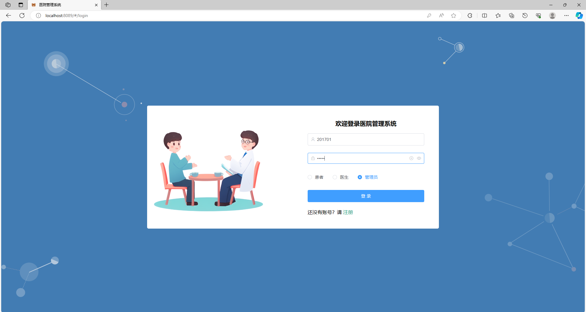
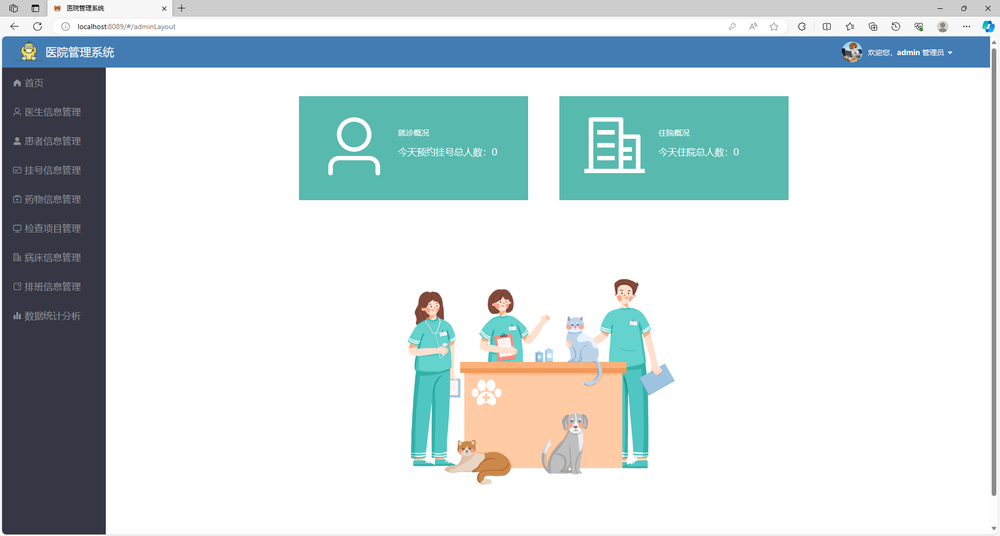
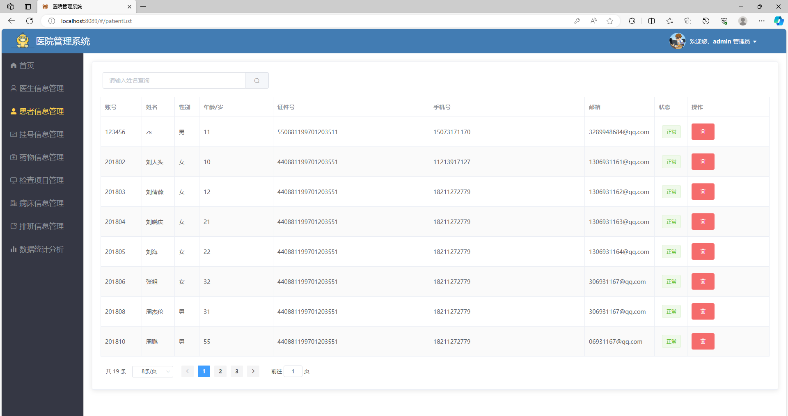
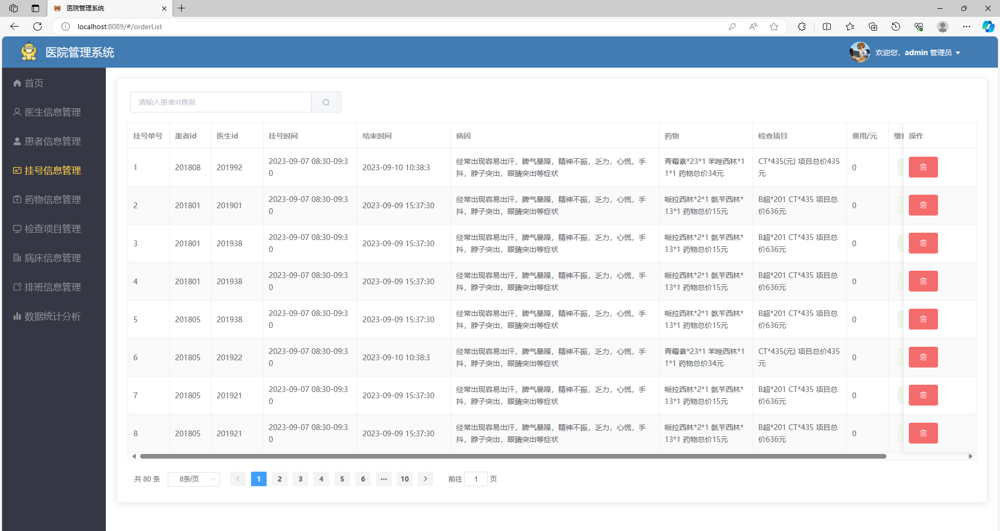
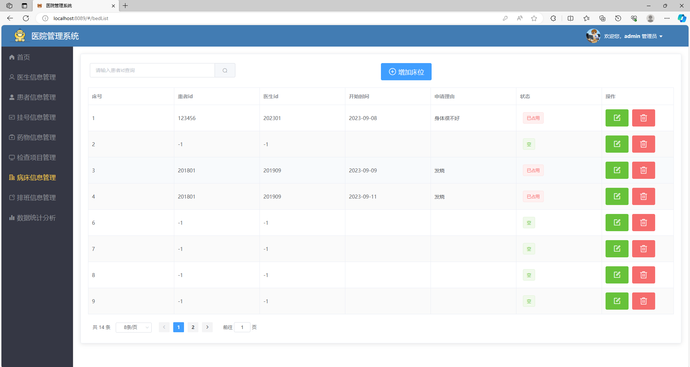
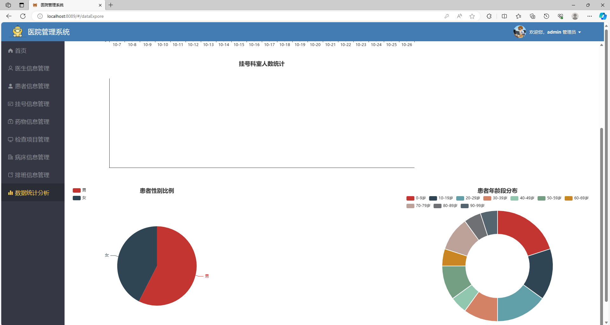
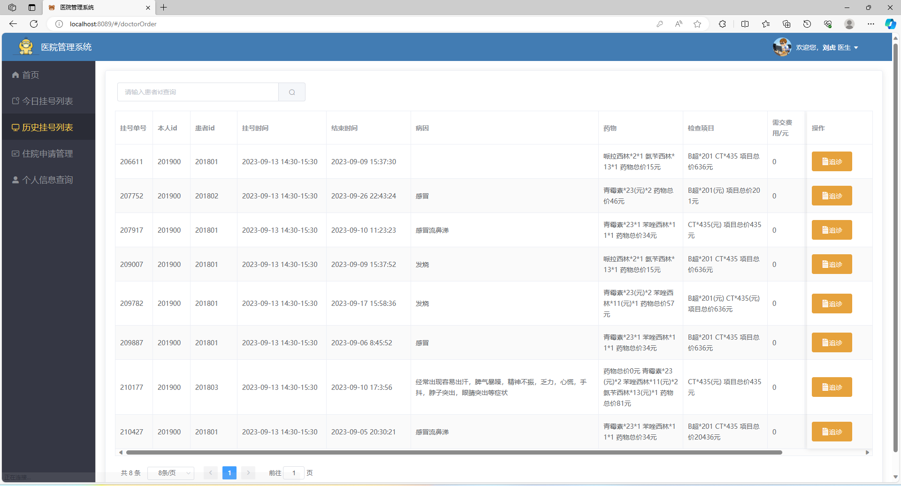
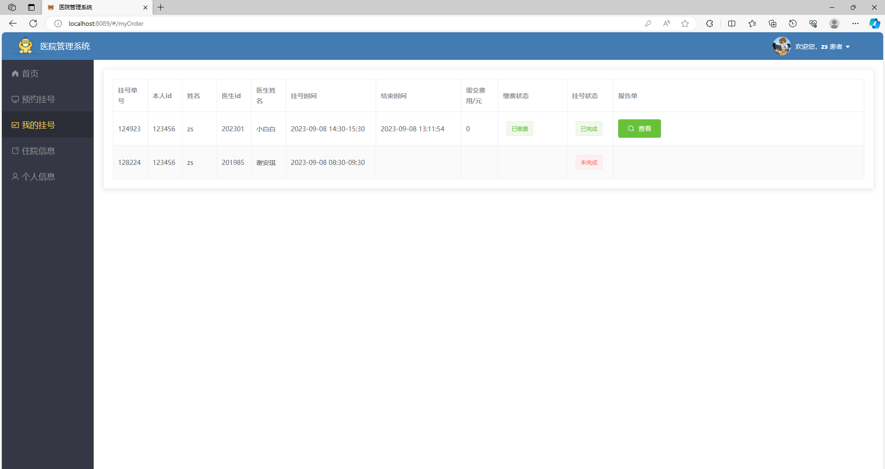

# 基于springboot+vue实现的医院管理系统

有问题，或者需要协助调试运行项目的, 可以加QQ：2529519551，或者微信 ：xzxj0206 注明项目，“git+项目名称” ，如：“git医院管理系统”
更多项目： https://github.com/34426?tab=repositories

## 项目介绍
基于springboot+vue的前后端分离的医院管理系统
角色：管理员、患者、医生
基于springboot vue实现的医院管理系统，有管理员、医生和患者三种角色。
系统拥有丰富的功能，能够满足各类用户的需求，系统提供了登录和注册功能，确保用户的信息安全和权限管理。
管理员：医生信息管理、患者信息管理、挂号信息管理、药物信息管理、检查项目管理、病床信息管理、排班信息管理、数据统计分析
医生：今日挂号列表、历史挂号列表、住院申请管理
开发语言：Java
项目技术：
后端： SpringBoot+Mybaits-Plus+Redis
前端：Vue +ElementUI 
项目架构：B/S架构
数据库: MySQL

### 一、部分项目功能图展示

