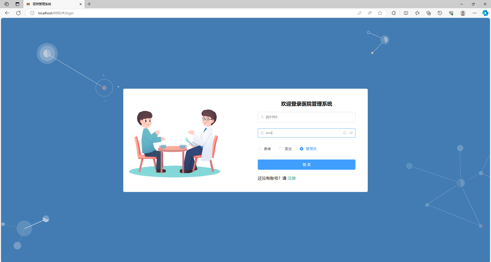
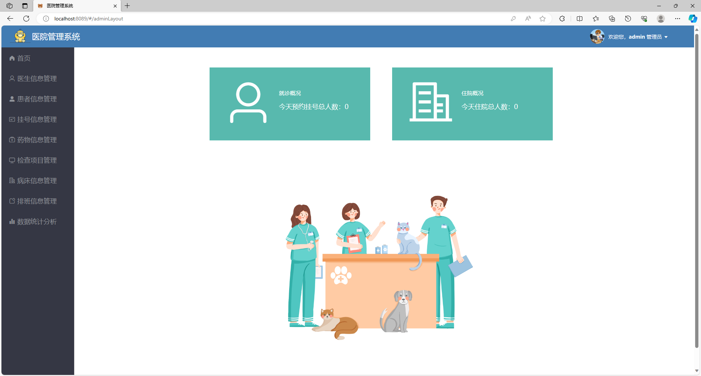
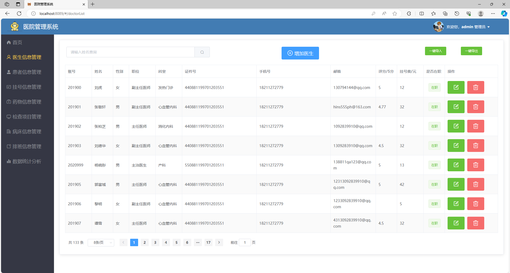

## 基于springboot+vue实现的医院管理系统带万字论文

### 完整项目获取

通过网盘分享的文件：医院管理系统

链接: https://pan.baidu.com/s/1L9GDT0TOyHq28N_0p60kiA?pwd=jh35 提取码: jh35 --来自百度网盘超级会员v3的分享

通过网盘分享的文件：工具包

链接: https://pan.baidu.com/s/1YmdoJvkjoUjA75wvHLDZ6A?pwd=xm96 提取码: xm96
--来自百度网盘超级会员v3的分享

需要远程项目部署或项目修改和毕业设计也可联系（添加申请时请备注好来意）

通过网盘分享的文件：远程调试部署联系方式

链接: https://pan.baidu.com/s/1W0dDcoZmayG0c7USJDYBYg?pwd=nqd7 提取码: nqd7
--来自百度网盘超级会员v3的分享

### 项目合集(项目不断更新中)
链接: https://pan.baidu.com/s/1nY-zhvAK0CXYcn3g7LzQnQ?pwd=id3c 提取码: id3c
--来自百度网盘超级会员v3的分享

#### 这些项目一起发你了 可以分享给你需要的同学 调试可找我 也接二次修改和项目定制、毕业设计等

## 接毕业设计和论文

微信联系方式：xzxj0206  QQ：3808981644   (支持修改、 部署调试、 支持代做毕设)

接网站建设、小程序、H5、APP、各种系统等，单片机、嵌入式也可以做

选题+开题报告+任务书+程序定制+安装调试+论文+答辩ppt  都可以做

### 一、项目介绍
基于springboot+vue的前后端分离的医院管理系统

语言：java 

运行工具：idea或eclipse vscode 数据库：mysql  

角色：管理员、患者、医生

基于springboot vue实现的医院管理系统，有管理员、医生和患者三种角色。

系统拥有丰富的功能，能够满足各类用户的需求，系统提供了登录和注册功能，确保用户的信息安全和权限管理。

管理员：医生信息管理、患者信息管理、挂号信息管理、药物信息管理、检查项目管理、病床信息管理、排班信息管理、数据统计分析

医生：今日挂号列表、历史挂号列表、住院申请管理

开发语言：Java

项目技术：

后端： SpringBoot+Mybaits-Plus+Redis

前端：Vue +ElementUI 

项目架构：B/S架构

数据库: MySQL

### 一、部分项目功能图展示

### 9.9￥ 获取完整源码+sql，需要加Q：3577148218 ,备用Q: 3808981644
### 有问题，或者需要协助调试运行项目的也可联系

